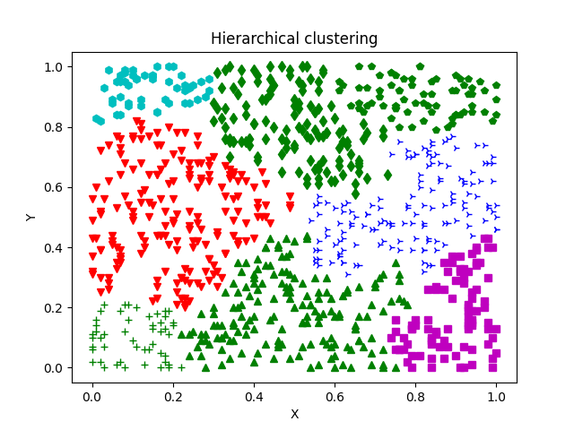

# Hierarchical clustering

## Description

This labwork implements hierarchical clustering algorithm, 
targeted at grouping a set of points (in this case, 2D points, but the code
supports any amount of dimensions) into specified amount of clusters. 
You can read more [here](https://en.wikipedia.org/wiki/Hierarchical_clustering). 
This code generates a set of 88 linearly distributed points in the 1x1 square, and then
groups them into the desired amount of clusters. Colors and types of points' markers
are picked randomly from the manually specified list of [matplotlib](https://matplotlib.org/stable/index.html)
supported types. 

## How to run
If needed, create virtualenv:

    $ python3 -m venv venv
    $ source venv/bin/activate

Run the labwork:

    $ python3 main.py [desired amount of clusters]